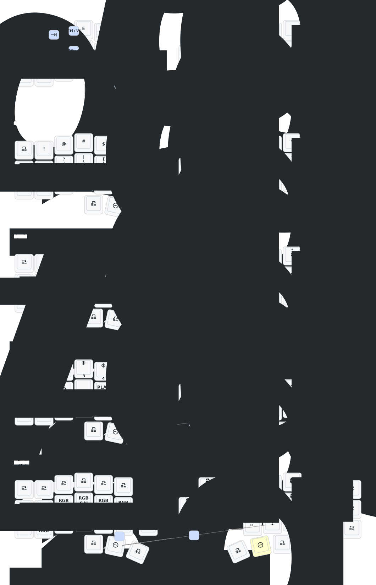

## Corne Keyboard Config

This is my custom [ZMK](https://zmk.dev/) keymap config for the low profile Corne (3x6) wireless keyboard.


See the [gallery](./docs/gallery) for more images.

---

## Keymap Diagram



## Firmware Configs and Decisions

Key Bluetooth and Prospector configurations:

```ini
# Bluetooth configurations
CONFIG_BT_CTLR_TX_PWR_PLUS_8=y
CONFIG_ZMK_BLE_EXPERIMENTAL_CONN=y
CONFIG_ZMK_BLE_KEYBOARD_REPORT_QUEUE_SIZE=32

# Prospector Scanner integration
CONFIG_ZMK_STATUS_ADVERTISEMENT=y
CONFIG_ZMK_STATUS_ADV_KEYBOARD_NAME="Corne Kbd"
CONFIG_ZMK_STATUS_ADV_CENTRAL_SIDE="LEFT"
CONFIG_PROSPECTOR_EXPECTED_PERIPHERAL_COUNT=1

...
```

> See [config/eyelash_corne.conf](./config/eyelash_corne.conf) for the full configuration options overview.

## Flashing instructions

- Go to the [ZMK Keymap Editor](https://nickcoutsos.github.io/keymap-editor/), connect this repository and add the desired keys.
- Save the layout, after that go to the github actions tab and wait for the _firmware_ building process to finish.
- Download the `.zip` file and extract the files.

> You will notice that we have three files with the `.uf2` extension, we'll use them to flash the new firmware to halves.

- Turn off the keyboard halve, and plug it with the USB-C cable, reset the keyboard by pressing the "reset button" twice.
- After the controller will recognized by the computer as an external drive, copy and paste the appropriate `.uf2` file to it, the device will disconnect automatically after the flashing process.
- Do the same thing to the other halve.

> [!NOTE]
> Sometimes a message might be showed after flashing the keyboard with the `.uf2` files, but generally we can just ignore it, as it happens after the flash process finishes and the micro controller unmount automatically before the OS knowing if the process was successful, see the [troubleshooting section](https://v0-3-branch.zmk.dev/docs/troubleshooting/flashing-issues) of ZMK for details.

- Now you need to turn on the halves and press the "reset button" one time on each halve (at the same time), so that the parts can connect and communicate between each other.

> For further information go to the [official documentation](https://v0-3-branch.zmk.dev/docs/user-setup#flashing-uf2-files) for ZMK.
